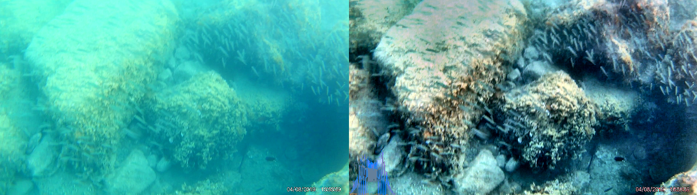
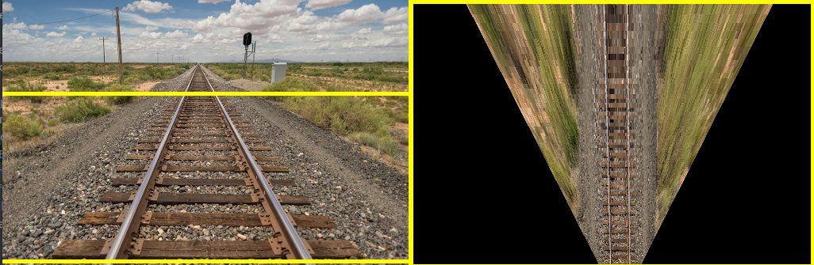
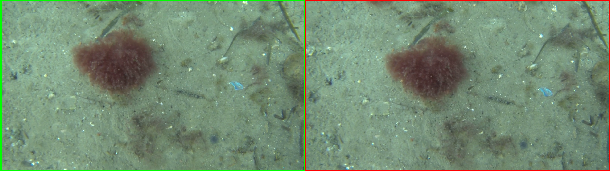
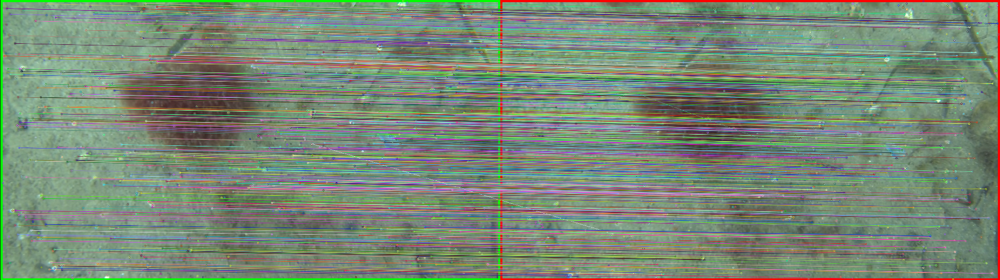
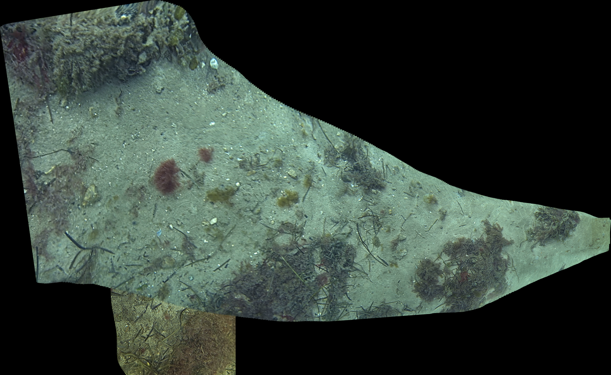

# mosaic-library #

`pip install mosaic-library`

This is a python library for manipulating images for underwater mosaicking applications. Currently, this libary is 
capable of:

1. Reading input videos with the [VideoPlayer class](https://github.com/DTUAqua-ObsTek/mosaic-library/blob/f4886e378631c6e3bc91d5ca89018cff75419e03/mosaicking/utils.py#L90)
2. Applying color, contrast, and lighting balancing as well as detail enhancement.
3. Other image manipulations such as resizing for faster mosaicking.
4. Image registration, such as feature detection and description, matching, and transformation estimation in pure translation, similarity, affine, and perspective classes.
5. Infinite and finite homography transformations on imagery given extrinsic rotations and translations between the camera and a new "virtual" camera.
6. Basic time synchronisation between camera position and rotation in the world frame with the video.
7. Visualisation of the preprocessing, feature detection / registration, homographic transform, and mosaicking steps.
8. Basic mosaicking map generation, with minimal memory management support (tiling).
   
## Future Roadmap ##

1. Estimation of a ground plane given additional extrinsic information from the mobile camera platform. 
2. Estimation and removal of vanishing line to reduce OutOfMemory errors due to excessive image warping.
3. Memory management through iterative updating of mosaic tiles according to a common mosaic coordinate system.

## Getting Started ##

### Prerequisites ###

First, make sure you have installed either [Python 3.9.X](https://www.python.org/downloads/release/python-396/) or
[Python 3.10.X](https://www.python.org/downloads/release/python-31011/) for your operating system.

**NOTE: Make sure to check the "add python to path" option.** 

Second, install [git](https://git-scm.com/book/en/v2/Getting-Started-Installing-Git) on your system.

**NOTE: Make sure to add git to your system's path variable.**

### Option 1: Using an IDE ###

Install an Integrated Development Environment, such as [PyCharm Community](https://www.jetbrains.com/pycharm/download).

See [this tutorial](https://www.jetbrains.com/help/pycharm/creating-empty-project.html) for setting up a PyCharm project.

### Option 2: Via command prompt / terminal ###

**NOTE: The python commands below use `python3` as the symbolic link to the python executable, 
however your os may have mapped the `python` symbolic link to your installed python executable.
If you get an error stating that python3 cannot be found, or if the Microsoft store appears, then use `python` instead.**

1. Open up command prompt / PowerShell (windows), or a terminal (mac / linux.)
2. Make a directory for you project: `mkdir mosaic-tutorial; cd mosaic-tutorial`
3. Install the `virtualenv` package: `python3 -m pip install venv`
4. Create the virtual environment: `python3 -m virtualenv venv`
5. Activate the virtual environment 
   - **Windows**: `venv\Scripts\activate.bat`
   - **mac / linux**: `source venv/bin/activate`
6. Install the mosaic-library package: `python3 -m pip install mosaic-library` (internet connection required).

## Examples ##
The examples used here are found [here](https://github.com/DTUAqua-ObsTek/mosaic-library/tree/main/examples), this 
section assumes you have copied these scripts into `mosaic-tutorial/examples`. The data used to generate the images below
come from [here](https://github.com/DTUAqua-ObsTek/mosaic-library/tree/main/data).

### Preprocessing Images ###
Images are essentially 3-Dimensional Tensors (Videos are 4-Dimensional), and so typical linear algebraic operations (matrix 
multiplication, inversion, *etc.*) will work on them. Images can appear faded or have low-contrast due to underwater
effects. Histogramming techniques can balance the color intensity between channels (color fixing), balance the overall
light intensity of the image, or balance the contrast of the image. Additionally, a sharpness filter [cv2.detailEnhance](https://docs.opencv.org/4.x/df/dac/group__photo__render.html#ga0de660cb6f371a464a74c7b651415975)
has been exposed in `mosaicking.preprocessing.enhance_detail`

Several of the functions available in mosaicking.preprocessing have been implemented in [preprocessing-playground.py](examples/perspective-playground.py).
Simply run `python examples/preprocessing-playground.py path/to/your/image.jpg` to get started.



### Transforming Images ###
Applying geometric transformations to images is relatively easy. A rotation matrix, R, that specifies the roll, pitch, and yaw
angles can rotate an image about its optical center in sequence to appear as if looked at from an equivalent camera from 
a different orientation. This is useful for projecting an image onto a desired plane (such as a ground plane).
Additionally, translation transformations can be applied to the image. This, in combination with rotation, can align images
taken at different positions. In both situations it is essential to know the intrinsic properties of the camera in order
to correct for changes in perspective. If we have some idea of where the camera is relative to the image, then we can warp the image
by rotating it about the approximate camera position.

The [perspective-playground.py](examples/perspective-playground.py) example investigates and applies extrinsic and intrinsic transformations to the image.
See if you can make the train tracks appear parallel. Run the program with `python examples/perspective-playground.py path/to/your/image.jpg`.
To exit, press ESC or close the window.

Some questions:

**Why do the rails appear to vanish to a single point in the original image?**

**What are we doing with the camera when we shift the perspective like this?**

**What is lost when we adjust the camera to make the rails parallel?**



### Registration ###
The process of identifying common features in two or more images and then estimating transformations to align them is called
"registration". Registration involves three major steps:

1. Feature detection: use an algorithm (such as ORB or SIFT) to detect and compute features in each image.
2. Feature matching: use a matching algorithm to identify features from each image that are sufficiently similar to each other.
3. Transformation estimation: use a linear transformation model (such as affine or perspective homography), and search through model parameters that sufficiently explain the transformation of matched features in one image to the matched features in the second.

[registration-playground.py](examples/registration-playground.py) performs these steps using functions defined in [mosaicking.registration](mosaicking/registration.py).
Run the program like so `python examples/registration-playground.py path/to/image1.png path/to/image2.png`.





### Mosaicking ###
Mosaicking is the process of finding correspondences between images and arranging them so that they create a larger image.
Videos or sequences of images can be used to incrementally expand a mosaic by adding in new tiles with each new frame. 
The images are preprocessed first to increase clarity and sharpness (making it easier to find features), then a transformation
is computed between the existing mosaic and the new image that maximises correlation between the matched features. 
Then similarity, affine or perspective transformations (similar to the train example) are applied to the image.
These steps are iterated over each new image, and the mosaic grows.

The mosaicking script has been exposed as a command (make sure you have it added to your path) as well as through the module.

To see the usage:

```
mosaic.py -h

usage: mosaic.py [-h] [--output_directory OUTPUT_DIRECTORY] [--start_time START_TIME | --start_frame START_FRAME]
                 [--finish_time FINISH_TIME | --finish_frame FINISH_FRAME] [--frame_skip FRAME_SKIP]
                 [--orientation_file ORIENTATION_FILE] [--sync_points SYNC_POINTS SYNC_POINTS | --time_offset TIME_OFFSET]
                 [--min_matches MIN_MATCHES] [--min_features MIN_FEATURES] [--max_warp_size MAX_WARP_SIZE [MAX_WARP_SIZE ...]]
                 [--max_mosaic_size MAX_MOSAIC_SIZE] [--save_freq SAVE_FREQ] [--scale_factor SCALE_FACTOR] [--alpha ALPHA]
                 [--show_rotation] [--show_mosaic] [--show_preprocessing] [--imadjust] [--equalize_color] [--equalize_luminance]
                 [-c CALIBRATION] [-k INTRINSIC INTRINSIC INTRINSIC INTRINSIC INTRINSIC INTRINSIC INTRINSIC INTRINSIC INTRINSIC]
                 [-d DISTORTION [DISTORTION ...]] [-x XROTATION] [-y YROTATION] [-z ZROTATION] [-g GRADIENTCLIP] [-f]
                 [--homography {rigid,similar,affine,perspective}] [--demo] [--show_demo]
                 [--features {ORB,SIFT,SURF,BRISK,KAZE,ALL} [{ORB,SIFT,SURF,BRISK,KAZE,ALL} ...]] [--show_matches] [--inliers_roi]
                 video

positional arguments:
  video                 Path to video file.

options:
  -h, --help            show this help message and exit
  --output_directory OUTPUT_DIRECTORY
                        Path to directory where output mosaics are to be saved. Default is invokation path.
  --start_time START_TIME
                        Time (secs) to start from.
  --start_frame START_FRAME
                        Frame number to start from.
  --finish_time FINISH_TIME
                        Time (secs) to finish at.
  --finish_frame FINISH_FRAME
                        Frame number to finish at.
  --frame_skip FRAME_SKIP
                        Number of frames to skip between each mosaic update.
  --orientation_file ORIENTATION_FILE
                        Path to .csv file containing orientation measurements that transform world to the camera frame.
  --sync_points SYNC_POINTS SYNC_POINTS
                        Time points (sec) where video and orientation file are in sync, used to calculate time offset between video and
                        timestamps in orientation file.
  --time_offset TIME_OFFSET
                        Time offset (sec) between video and orientation file timestamps, used for synchronization.
  --min_matches MIN_MATCHES
                        Minimum number of matches to proceed with registration.
  --min_features MIN_FEATURES
                        Minimum number of features to detect in an image.
  --max_warp_size MAX_WARP_SIZE [MAX_WARP_SIZE ...]
                        Maximum size of warped image (used to prevent OOM errors), if 1 argument given then image is clipped to square,
                        if 2 then the order is height, width.
  --max_mosaic_size MAX_MOSAIC_SIZE
                        Largest allowable size (width or height) for mosaic. Creates a new tile if it gets bigger.
  --save_freq SAVE_FREQ
                        Save frequency for output mosaic (if less than 1 then output saves at exit).
  --scale_factor SCALE_FACTOR
                        Scale the input image with constant aspect ratio.
  --alpha ALPHA         Alpha blending scalar for merging new frames into mosaic.
  --show_rotation       Flag to display the rotation compensation using rotation data.
  --show_mosaic         Flag to display the mosaic output.
  --show_preprocessing  Flag to display the preprocessed image
  --imadjust            Flag to preprocess image for color balance.
  --equalize_color      Flag to preprocess image for contrast equalization.
  --equalize_luminance  Flag to preprocess image for lighting equalization.
  -c CALIBRATION, --calibration CALIBRATION
                        Path to calibration file, overrides --intrinsic and --distortion.
  -k INTRINSIC INTRINSIC INTRINSIC INTRINSIC INTRINSIC INTRINSIC INTRINSIC INTRINSIC INTRINSIC, --intrinsic INTRINSIC INTRINSIC INTRINSIC INTRINSIC INTRINSIC INTRINSIC INTRINSIC INTRINSIC INTRINSIC
                        Space delimited list of intrinsic matrix terms, Read as
                        K[0,0],K[0,1],K[0,2],K[1,0],K[1,1],K[1,2],K[2,0],K[2,1],K[2,2]. Overriden by calibration file if intrinsic
                        present.
  -d DISTORTION [DISTORTION ...], --distortion DISTORTION [DISTORTION ...]
                        Space delimited list of distortion coefficients, Read as K1, K2, p1, p2. Overriden by calibration file if
                        distortion present.
  -x XROTATION, --xrotation XROTATION
                        Rotation around image plane's x axis (radians).
  -y YROTATION, --yrotation YROTATION
                        Rotation around image plane's y axis (radians).
  -z ZROTATION, --zrotation ZROTATION
                        Rotation around image plane's z axis (radians).
  -g GRADIENTCLIP, --gradientclip GRADIENTCLIP
                        Clip the gradient of severely distorted image.
  -f, --fisheye         Flag to use fisheye distortion model.
  --homography {rigid,similar,affine,perspective}
                        Type of 2D homography to perform.
  --features {ORB,SIFT,SURF,BRISK,KAZE,ALL} [{ORB,SIFT,SURF,BRISK,KAZE,ALL} ...]
                        Set of features to use in registration.
  --show_matches        Display the matches.
  --inliers_roi         Only allow the convex hull of the inlier points to be displayed.

  --demo                Creates a video of the mosaic creation process. For demo purposes only.
  --show_demo           Display the demo while underway.
```

It is important the camera's view is mostly occupied by a scene that lies
on a plane or where the distance of the camera to the scene is much greater than the relative distances of the objects
in the scene (such as satellite imagery and the seabottom). Control of the camera to keep the ground plane 
in sight is essential as the new image will become smaller and smaller with respect to the mosaic
as the camera moves "into" or "through" the mosaic.  Eventually the number of common features between the mosaic and the image
will diminish to the point where no good transformation can be found. Or the camera may view something that does not have enough
features to estimate a transformation. Or, the mosaic size might get too big. 
The current implementation simply just dumps the mosaic to tiles (called tile_001.png, tmp_002.png etc.)
and starts a new mosaic if any of the mentioned issues occur.



#### Activities ####
1. Create your own video and see how large a mosaic you can create (substitute your video path in for the one given in the instructions).
2. What kind of camera control and survey works best?
3. Apart from color, contrast and lighting transforms, are there any geometric transformations that we could apply to get better results?

Some questions:

**Do any parts of the mosaic appear poorer in quality than others? If so, why?**

**What happens when the camera passes over something that is not co-planar and quite large (for examples, a large boulder)?**

**What happens when a fish or other moving objects comes into view?**

### Calibration ###

It is useful in image geometry to know certain properties of a camera, called the intrinsic properties. These properties
are used to model the behaviour of projecting 3D points onto a 2D image plane for the camera. The model typically used is
the "pinhole camera model". These properties are usually represented in the so-called "intrinsic matrix", `K`. A simple
form (no skew) for `K` is shown below:

$$
K = \begin{bmatrix}
f_x & 0 & c_x \\
0 & f_y & c_y \\
0 & 0 & 1
\end{bmatrix}
$$

Where $f_x$ and $f_y$ are the focal lengths in the image coordinate frame x and y directions respectively, 
measured in pixels. $c_x$ and $c_y$ are the principle points in the image coordinate frame x and y directions respectively.
Since focal lengths of cameras are generally reported in mm, the method for converting is as follows:

$$
\begin{aligned}
f_x &= \frac{f\times w}{W} \\
f_y &= \frac{f\times h}{H}
\end{aligned}
$$

Where $f$ is the focal length measured in mm, $w$ is the image width in pixels, $W$ is the sensor width in mm,
$h$ is the image height in pixels, and $H$ is the sensor height in mm. Information on a variety of commonly used
sensors are available [here](https://en.wikipedia.org/wiki/Image_sensor_format#Table_of_sensor_formats_and_sizes).

Additionally, the effects of the lens can distort the path of light making objects that should be straight appear curved.
These distortion effects can be modelled, and the model parameters are usually referred to as "distortion coefficients",
`D`. The number of coefficients depends on the model selected.

`calibration.py` provides an implementation of OpenCV's [calibrateCamera](https://docs.opencv.org/4.7.0/d9/d0c/group__calib3d.html#ga3207604e4b1a1758aa66acb6ed5aa65d).
To calibrate a camera using this tool, you will need the following:

1. A camera calibration checkerboard sheet mounted to a stiff plate (see [here](https://markhedleyjones.com/projects/calibration-checkerboard-collection))
2. The number of inner corner vertices (i.e. where the corner of a blacksquare touches the corner of another black square) of the checkerboard (rows and columns)
3. The length of the side of the checkerboard squares in mm.
4. A video recording (about 60 - 90 seconds) taken by your camera of the checkerboard sheet at a variety of positions, orientations and scales, all interior corners need to be visible for a given video frame to have valid calibration data. Full coverage of the camera's field of view is necessary to estimate distortion coefficients properly.

Run the calibration tool as follows: `calibration.py --cb_pattern number_of_cols number_of_rows --square_size side_length_mm --reduction_fraction 0.25 --model radtan path/to/your/calibration/video.mp4 output/calibration/path.json`

The outputted calibration `K` and `D` matrices will be located in the `.json` file.
