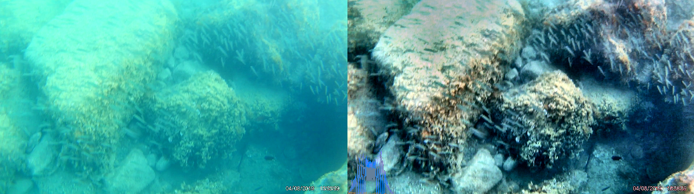
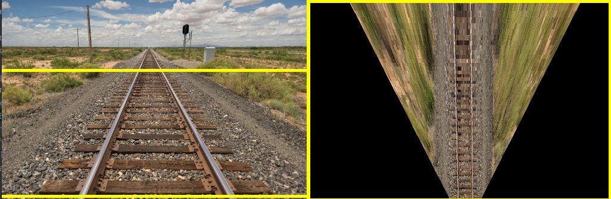
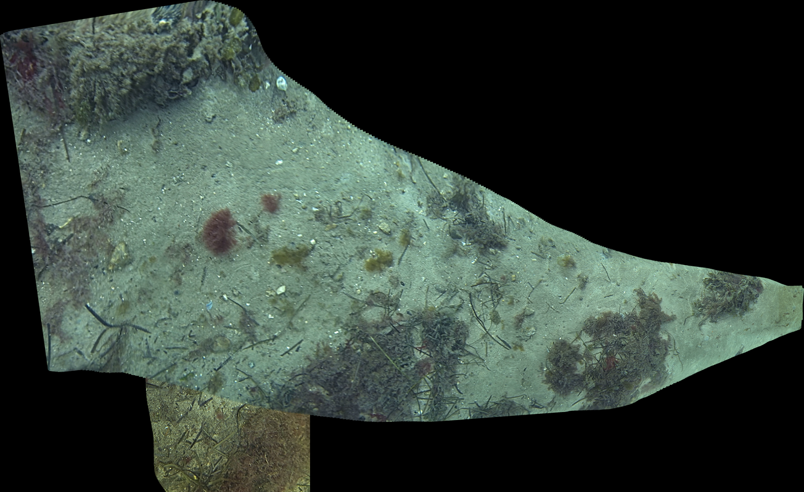
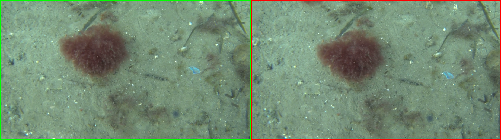
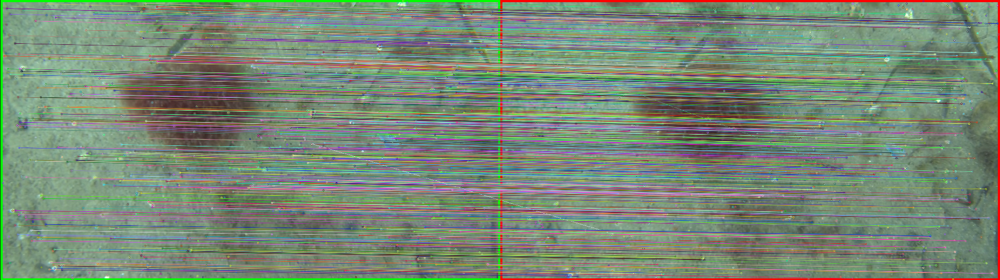
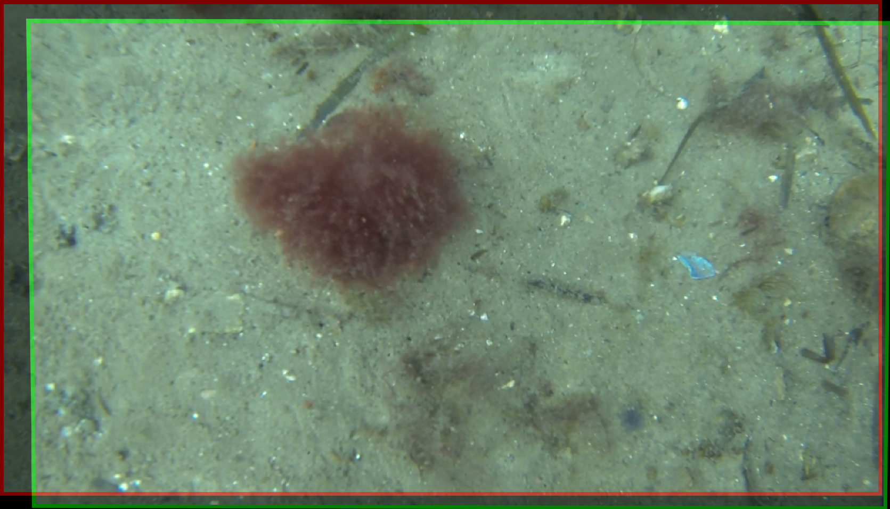

Getting Started
---------------

Installation for CLI Usage
~~~~~~~~~~~~~~~~~~~~~~~~~~

Install mosaic-library via ``pip install mosaic-library[opencv]``.

Run ``mosaicking-mosaic -h`` or ``mosaicking-calibration -h`` for supported CLI scripts.

Installation for Developers / Integrators
~~~~~~~~~~~~~~~~~~~~~~~~~~~~~~~~~~~~~~~~~

We recommend using an Integrated Development Environment, such as `PyCharm
Community <https://www.jetbrains.com/pycharm/download>`__ or `Visual Studio Code <https://code.visualstudio.com/>`__. See `this
tutorial <https://www.jetbrains.com/help/pycharm/creating-empty-project.html>`__
for setting up a PyCharm project.

For implementing mosaic-library with your own OpenCV build: ``pip install mosaic-library``

For a pre-baked OpenCV backend: ``pip install mosaic-library[opencv]``

If you want a supported OpenCV build, you can build one of the docker stages available on `the repository <https://github.com/DTUAqua-ObsTek/mosaic-library/tree/devel/docker/>`__.
Three versions of the opencv build are currently available.

1. OpenCV CUDA
2. OpenCV CUDA + CUDACODEC
3. OpenCV CUDA + CUDACODEC + NONFREE

See the building with docker guide for further information.

CLI Usage Examples
------------------

The examples here use data available on `the repository <https://github.com/DTUAqua-ObsTek/mosaic-library/tree/devel/data/>`__.

A simple sequential model can be applied via ``mosaicking-mosaic``:

.. literalinclude:: assets/snippets/cli_examples_01.txt
    :language: bash

To see the full help documentation:

.. literalinclude:: assets/snippets/cli_examples_02.txt
    :language: bash

Program Integration Examples
----------------------------

Apart from the API, we have some examples providing implementations of some or all features of mosaic-library.
You can find the examples `here <https://github.com/DTUAqua-ObsTek/mosaic-library/tree/devel/examples>`__,

Primers and Exercises
---------------------

Preprocessing Images
~~~~~~~~~~~~~~~~~~~~

Images are essentially 3-Dimensional Tensors (Videos are 4-Dimensional),
and so typical linear algebraic operations (matrix multiplication,
inversion, *etc.*) will work on them. Images can appear faded or have
low-contrast due to underwater effects. Histogramming techniques can
balance the color intensity between channels (color fixing), balance the
overall light intensity of the image, or balance the contrast of the
image. Additionally, a sharpness filter
`cv2.detailEnhance <https://docs.opencv.org/4.x/df/dac/group__photo__render.html#ga0de660cb6f371a464a74c7b651415975>`__
has been exposed in ``mosaicking.preprocessing.enhance_detail``

Several of the functions available in mosaicking.preprocessing have been
implemented in
`preprocessing-playground.py <https://github.com/DTUAqua-ObsTek/mosaic-library/blob/devel/examples/preprocessing-playground.py>`__.
Simply run
``python3 preprocessing-playground.py path/to/your/image.jpg``
to get started.

   Result of preprocessing

Transforming Images
~~~~~~~~~~~~~~~~~~~

Applying geometric transformations to images is relatively easy. A
rotation matrix, R, that specifies the Euler roll, pitch, and yaw angles can
rotate an image about its optical center in sequence to appear as if
looked at from an equivalent camera from a different orientation. The
homography transformation of a calibrated image undergoing pure rotation
is as follows:

.. math::

    H = K \cdot R \cdot K^{-1}

This is useful for projecting an image onto a desired plane (such as a ground
plane). Additionally, translation transformations can be applied to the
image. This, in combination with rotation, can align images taken at
different positions. In both situations it is essential to know the
intrinsic properties of the camera and lens in order to correct for changes
in perspective. If we have some idea of where the camera is relative to the
image, then we can warp the image by rotating it about the approximate
camera position.

The `perspective-playground.py <https://github.com/DTUAqua-ObsTek/mosaic-library/blob/devel/perspective-playground.py>`__
example investigates and applies extrinsic and intrinsic transformations
to the image. See if you can make the train tracks appear parallel. Run
the program with
``python3 examples/perspective-playground.py path/to/your/image.jpg``. To
exit, press ESC or close the window.

Some questions:

**Why do the rails appear to vanish to a single point in the original image?**

**What are we doing with the camera when we shift the perspective like this?**

**What is lost when we adjust the camera to make the rails parallel?**

   Example rail homography

Registration
~~~~~~~~~~~~

The process of identifying common features in two or more images and
then estimating transformations to align them is called “registration”.
Registration involves three major steps:

1. Feature detection: use an algorithm (such as ORB or SIFT) to detect
   and compute features in each image.
2. Feature matching: use a matching algorithm to identify features from
   each image that are sufficiently similar to each other.
3. Transformation estimation: use a linear transformation model (such as
   affine or perspective homography), and search through model
   parameters that sufficiently explain the transformation of matched
   features in one image to the matched features in the second.

`registration-playground.py <https://github.com/DTUAqua-ObsTek/mosaic-library/blob/devel/registration-playground.py>`__
performs these steps using functions defined in
`mosaicking.registration <mosaicking/registration.py>`__. Run the
program like so
``python examples/registration-playground.py path/to/image1.png path/to/image2.png``.

|Image Pair| |Matched Features| |Registered Images|

Mosaicking
~~~~~~~~~~

Mosaicking is the process of finding correspondences between images and
arranging them so that they create a larger image. Videos or sequences
of images can be used to incrementally expand a mosaic by adding in new
tiles with each new frame. The images are preprocessed first to increase
clarity and sharpness (making it easier to find features), then a
transformation is computed between the existing mosaic and the new image
that maximises correlation between the matched features. Then
similarity, affine or perspective transformations (similar to the train
example) are applied to the image. These steps are iterated over each
new image, and the mosaic grows.

The mosaicking script has been exposed as a command (make sure you have
it added to your path) as well as through the module.

It is important the camera’s view is mostly occupied by a scene that
lies on a plane or where the distance of the camera to the scene is much
greater than the relative distances of the objects in the scene (such as
satellite imagery and the seabottom). Being too close to a bumpy bottom
will introduce significant parallax error that will affect the registration
of the mosaic.

Control of the camera to keep the ground plane in sight is
essential as the new image will become smaller and smaller with respect to
the mosaic as the camera moves “through” or "out of" the mosaic's image
plane. This will cause out-of-plane shrinking or growing of the mosaic.
In this case, you should either carefully select the reference image
(i.e. the geometric center of the mosaic) to be from a camera whose pose is
as perpendicular to the ground plane as possible (i.e. the image plane
and ground plane are parallel).

Alternatively, if you have an IMU that
measures the camera frame relative to a ground plane (such as the North-
East plane within a North-East-Down coordinate system), then you can
specify the rotation required to align the camera with with this frame.
This is the equivalent of expressing the inertial frame as a rotation from
the camera frame. In this case, it doubly important to keep the ground
plane as completely in-view as possible to reduce excessive perspective
warping.

The camera may view something that does not have enough features to
register a homography transformation to previous images.

   Mosaicking Result

Activities
^^^^^^^^^^

1. Create your own video and see how large a mosaic you can create
2. What kind of camera control and survey works best?
3. Apart from color, contrast and lighting transforms, are there any
   geometric transformations that we could apply to get better results?

Some questions:

**Do any parts of the mosaic appear poorer in quality than others? If so, why?**

**What happens when the camera passes over something that is not co-planar and quite large (for examples, a large boulder)?**

**What happens when a fish or other moving objects comes into view?**

Calibration
~~~~~~~~~~~

It is useful in image geometry to know certain properties of a camera,
called the intrinsic properties. These properties are used to model the
behaviour of projecting 3D points onto a 2D image plane for the camera.
The model typically used is the “pinhole camera model”. These properties
are usually represented in the so-called “intrinsic matrix”, ``K``. A
simple form (no skew) for ``K`` is shown below:

.. math::

   K = \begin{bmatrix}
   f_x & 0 & c_x \\
   0 & f_y & c_y \\
   0 & 0 & 1
   \end{bmatrix}

Where :math:`f_x` and :math:`f_y` are the focal lengths in the image
coordinate frame x and y directions respectively, measured in pixels.
:math:`c_x` and :math:`c_y` are the principle points in the image
coordinate frame x and y directions respectively. Since focal lengths of
cameras are generally reported in mm, the method for converting is as
follows:

.. math::

   \begin{aligned}
   f_x &= \frac{f\times w}{W} \\
   f_y &= \frac{f\times h}{H}
   \end{aligned}

Where :math:`f` is the focal length measured in mm, :math:`w` is the
image width in pixels, :math:`W` is the sensor width in mm, :math:`h` is
the image height in pixels, and :math:`H` is the sensor height in mm.
Information on a variety of commonly used sensors are available
`here <https://en.wikipedia.org/wiki/Image_sensor_format#Table_of_sensor_formats_and_sizes>`__.

Additionally, the effects of the lens can distort the path of light
making objects that should be straight appear curved. These distortion
effects can be modelled, and the model parameters are usually referred
to as “distortion coefficients”, ``D``. The number of coefficients
depends on the model selected.

``mosaicking-calibration`` provides an implementation of OpenCV’s
`calibrateCamera <https://docs.opencv.org/4.7.0/d9/d0c/group__calib3d.html#ga3207604e4b1a1758aa66acb6ed5aa65d>`__.
To calibrate a camera using this tool, you will need the following:

1. A camera calibration checkerboard sheet mounted to a stiff plate (see
   `here <https://calib.io/pages/camera-calibration-pattern-generator>`__)
2. The number of inner corner vertices (i.e. where the corner of a
   black square touches the corner of another black square) of the
   checkerboard (rows and columns)
3. The length of the side of the checkerboard squares in mm.
4. A video recording (about 60 - 90 seconds) taken by your camera of the
   checkerboard sheet at a variety of positions, orientations and
   scales, all interior corners need to be visible for a given video
   frame to have valid calibration data. Full coverage of the camera’s
   field of view is necessary to estimate distortion coefficients
   properly.

Run the calibration tool as follows:
``mosaicking-calibration --cb_pattern number_of_cols number_of_rows --square_size side_length_mm --reduction_fraction 0.25 --model radtan path/to/your/calibration/video.mp4 output/calibration/path.json``

The outputted calibration ``K`` and ``D`` matrices will be located in
the ``.json`` file.

